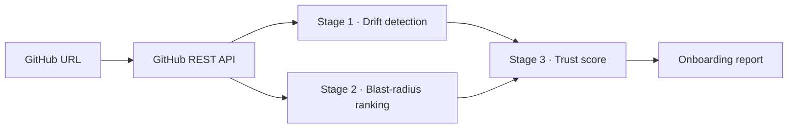

# Repo Autopsy

**Know what's safe to touch before you touch it.**

Repo Autopsy analyses a public GitHub repository and produces a clinical onboarding report: where a new contributor should start, what's risky to change, and how well the documentation reflects the actual code.

---

## The problem

Joining a new codebase is expensive. README docs go stale, TODO comments pile up with no indication of blast radius, and there's no quick way to know which files are safe to change on day one versus which ones will break half the app.

## The solution

Paste a GitHub URL. Repo Autopsy fetches the repository's documentation, imports, and open issues, then runs three analysis stages and returns a scored, ranked report in seconds — no clone required.

---

## How it works



| Stage | What happens |
|---|---|
| **1 · Drift** | Compares README / `.env.example` against up to 40 source files. Detects unused env-var references, missing setup files, and stale API route descriptions. |
| **2 · Blast radius** | Parses JS/TS imports to build a dependency graph. BFS (depth 5) counts how many modules each TODO/FIXME or open GitHub issue would affect if changed. Entry points and security labels receive a risk bump. |
| **3 · Trust score** | Subtracts three penalty buckets from 100 and assigns a band: **Ready**, **Needs care**, or **Risky onboarding**. |

---

## Scoring formula

```
score = 100 − drift_penalty − starter_penalty − risk_penalty   [clamped 0–100]
```

### Bucket 1 — Drift (max −40)
| Finding | Deduction |
|---|---|
| High severity | −12 pts each |
| Medium severity | −6 pts each |
| Low severity | −2 pts each |

### Bucket 2 — Starter-task availability (max −30)
| Condition | Deduction |
|---|---|
| No tasks documented | −10 pts |
| Tasks exist, none safe | −30 pts |
| Exactly 1 safe task | −15 pts |
| 2 or more safe tasks | 0 pts |

### Bucket 3 — Risk load (max −30)
| Task type | Deduction |
|---|---|
| Risky task | −5 pts each |
| Unknown-risk task | −2 pts each |

### Score bands
| Range | Band |
|---|---|
| 80 – 100 | **Ready** |
| 50 – 79 | **Needs care** |
| 0 – 49 | **Risky onboarding** |

See [/methodology](/methodology) for the full explanation including blast-radius computation details.

---

## Known limitations

- **Partial scan.** At most 40 source files are fetched. Large repos are analysed on a best-effort basis.
- **JS/TS only.** The import graph covers JavaScript and TypeScript. Python, Go, Rust, and other languages are not parsed.
- **Keyword matching for issues.** Issue-to-file mapping tokenises the issue title and matches against file names. Vague titles ("fix bug") produce unknown risk.
- **Heuristic drift checks.** Env-var extraction, route matching, and file-presence checks are regex-based — not semantic or AST-level analysis. False positives are possible.
- **No execution context.** Dynamic imports and conditional requires are not tracked.

---

## Setup

### Prerequisites

- Node.js 18+
- A GitHub personal access token (optional but recommended — raises API rate limit from 60 to 5 000 req/hour)

### Install

```bash
git clone https://github.com/<your-fork>/repo-autopsy
cd repo-autopsy
npm install
```

### Environment

Create `.env.local` in the project root:

```
GITHUB_TOKEN=ghp_your_token_here
```

### Run

```bash
npm run dev      # development server on http://localhost:3000
npm run build    # production build
npm test         # run Vitest unit tests
```

---

## Built with IBM Bob

This project was built entirely with [IBM Bob](https://www.ibm.com/products/bob), an AI coding assistant. Bob contributed to every stage of development:

| Stage | How Bob was used |
|---|---|
| **Architecture** | Designed the three-stage pipeline (drift → blast radius → trust score), defined the shared TypeScript type system in `lib/types.ts`, and planned the Next.js App Router structure. |
| **Drift detector** | Wrote `lib/driftDetector.ts` including the env-var extractor, gitignore parser, `ALWAYS_LOCAL_FILES` exclusion list, `CREATE_INTENT_VERBS` guard, and URL-not-route heuristic. |
| **Blast-radius ranker** | Implemented `lib/blastRadius.ts`: the import graph builder, BFS transitive-dependent counter, entry-point detection, dev-package classification, security-label bump, and the stop-word list. |
| **Trust score** | Implemented `lib/trustScore.ts` with the three penalty buckets, caps, clamping, band assignment, and top-issues generation. |
| **Report UI** | Built the full `app/report/[owner]/[repo]/page.tsx` in IBM Plex Sans/Mono with collapsible risk groups, skeleton loading states, and export-to-Markdown. |
| **Methodology page** | Wrote `app/methodology/page.tsx` — the plain-language explanation of all three stages, the exact formula, blast-radius rules, and known limitations. |
| **Tests** | Added `lib/__tests__/trustScore.test.ts`, `blastRadius.test.ts`, and `driftDetector.test.ts` — 48 unit tests covering scoring math, risk classification, sorting, gitignore exclusion, and URL-not-route guards. |
| **Documentation** | Rewrote this README with the architecture diagram, scoring tables, and limitations. |

Session transcripts are in [`bob_sessions/`](./bob_sessions/).

---

## Project structure

```
app/
  page.tsx                       # Home / URL input
  layout.tsx                     # IBM Plex fonts, global styles
  report/[owner]/[repo]/page.tsx # Streaming report UI
  methodology/page.tsx           # /methodology explainer page
  api/analyze/route.ts           # Server-side analysis orchestrator
lib/
  driftDetector.ts               # Stage 1: documentation drift
  blastRadius.ts                 # Stage 2: import graph + blast-radius ranking
  trustScore.ts                  # Stage 3: onboarding trust score
  github.ts                      # GitHub REST API helpers
  types.ts                       # Shared TypeScript types
  __tests__/                     # Vitest unit tests
bob_sessions/                    # AI session transcripts and screenshots
```
